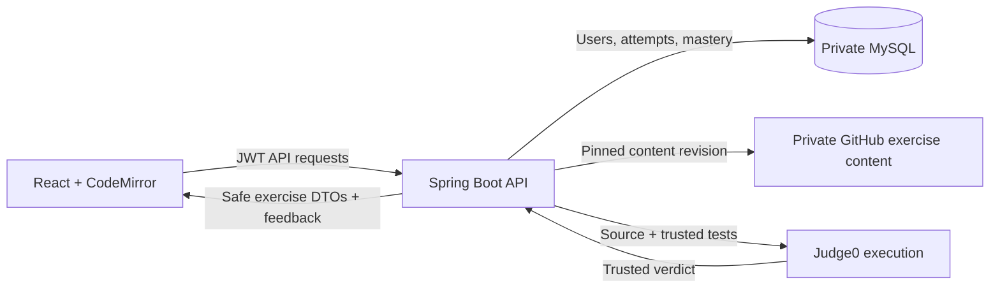

<div align="center">

<h1>⚙️ Code Calibrate</h1>

<p><strong>Java practice that meets you where you are.</strong></p>

<p>
  <a href="https://codecalibrate.dev">
    
  </a>
  
  
  
</p>

</div>

Code Calibrate is a full-stack Java practice platform that turns trusted exercise results into an explainable next recommendation. A learner registers, receives an exercise selected from their current mastery, writes Java in an embedded editor, submits it for isolated evaluation, and receives immediate feedback. The resulting verdict updates a data-focused dashboard and influences what the learner practices next.

| 🎯 Adaptive practice | 🔒 Trusted evaluation | 🚀 Production deployed |
| :---: | :---: | :---: |
| Mastery and attempt history drive the next recommendation. | Spring keeps private tests and persistence behind the API boundary. | React, Spring Boot, and private MySQL run as separate Railway services. |

## 📑 Contents

- [Current features](#current-features)
- [How the learning loop works](#how-the-learning-loop-works)
- [Architecture and trust boundaries](#architecture-and-trust-boundaries)
- [Technology stack](#technology-stack)
- [Run locally](#run-locally)
- [Verification](#verification)
- [Project structure](#project-structure)
- [Current limitations](#current-limitations)
- [Roadmap](#roadmap)

## ✨ Current features

### Learning experience

- Public landing page with project explanation and responsive navigation
- Scroll-focused landing story that visualizes the complete submission and recommendation flow
- Account registration, login, logout, and browser-session restoration
- Personalized dashboard with attempts, accepted results, completed exercises, accuracy, average mastery, and the next recommended exercise
- Skill-level mastery, Java pathway progress, and deduplicated recent exercise history
- Direct access to revisit previously attempted exercises
- Java exercises grouped by skills and a Java learning path
- Embedded CodeMirror editor with Java syntax highlighting, accessible keyboard guidance, and a persisted autocomplete toggle
- Authenticated exercise submission and immediate correct/incorrect feedback
- Inline submission progress, rectangular verdict panels, and a reduced-motion-aware success animation
- Mastery updates based on trusted exercise verdicts
- Recommendations that prioritize weak skills and unattempted exercises
- Collapsible, exercise-specific Java documentation references
- Filterable project resource library organized by technology
- Four color palettes, each with light and dark modes, persisted across pages
- Theme-aware transitions and landing animations with reduced-motion fallbacks

### Backend behavior

- Stateless JWT authentication enforced by Spring Security
- BCrypt password hashing
- MySQL persistence for users, curriculum metadata, attempts, and mastery
- Aggregated dashboard data for learner metrics, skill mastery, recent exercises, pathway progress, and recommendations
- Judge0 integration for isolated Java compilation and execution
- Private, commit-pinned exercise definitions retrieved through the GitHub API
- Trusted hidden tests that are never returned to the browser
- Documentation links restricted to approved HTTPS hosts
- Attempts persist the authenticated relationship, verdict, and timestamp—not submitted source code
- Consistent error translation for authentication, validation, missing resources, and unavailable providers

## 🔄 How the learning loop works

```text
Register or log in
        |
        v
Receive a recommended exercise
        |
        v
Write Java in CodeMirror
        |
        v
Submit through the authenticated Spring API
        |
        v
Run source + private tests through Judge0
        |
        v
Persist the trusted verdict and update mastery
        |
        v
Recommend the next useful exercise
```

The recommendation is intentionally explainable rather than opaque: Code Calibrate orders the learner's skills from lowest mastery upward, looks for an unattempted exercise for those skills, and falls back predictably when every matching exercise has been attempted.

## 🏗️ Architecture and trust boundaries



The Spring Boot API is the authority for authentication, exercise assembly, verdict handling, persistence, mastery, and recommendations. React never receives hidden test definitions or execution configuration.

Learner source code must be sent to Judge0 to evaluate a submission, but Code Calibrate does not store that source in MySQL. Persistence occurs only after evaluation completes, and the stored attempt records the authenticated user, exercise, trusted result, and submission time.

### Production deployment

The production system runs as separate Railway services:

- **Frontend:** a multi-stage Docker build compiles React with Vite, then Caddy serves the static application and handles client-side route fallback.
- **Backend:** a multi-stage Docker build packages and runs the Spring Boot application.
- **Database:** MySQL is reachable privately by the backend service.

Railway owns runtime configuration. Secrets such as the JWT signing key, GitHub token, database password, and Judge0 credentials are environment variables and are not committed to this repository.

## 🧰 Technology stack

| Layer | Technology |
| --- | --- |
| Frontend | React 19, React Router, Vite 8 |
| Styling | Tailwind CSS 4, semantic CSS theme variables |
| Editor | CodeMirror 6 with Java language support |
| Backend | Java 25, Spring Boot 4, Spring MVC |
| Security | Spring Security, JWT, BCrypt |
| Persistence | Spring Data JPA, MySQL |
| Testing | JUnit, Spring integration tests, H2 test database, ESLint, Vite production build |
| Exercise execution | Judge0 through RapidAPI |
| Exercise content | Private GitHub repository pinned to an exact commit |
| Deployment | Docker, Caddy, Railway |

## 🚀 Run locally

### Prerequisites

- Java 25
- Node.js 22 and npm
- MySQL
- A GitHub token that can read the private exercise-content repository
- Judge0/RapidAPI credentials

### 1. Prepare MySQL

Create a database named `code_calibrate`. Run these scripts against it in order:

1. [`backend/database/schema.sql`](backend/database/schema.sql)
2. [`backend/database/seed-data.sql`](backend/database/seed-data.sql)

The application uses `spring.jpa.hibernate.ddl-auto=validate`; it validates the schema but does not create missing tables for you.

### 2. Configure and start the backend

Set the following environment variables in the terminal or IDE run configuration that launches Spring Boot:

| Variable | Purpose | Example or default |
| --- | --- | --- |
| `DB_URL` | JDBC connection URL | `jdbc:mysql://localhost:3306/code_calibrate` |
| `DB_USERNAME` | MySQL user | `root` |
| `DB_PASSWORD` | MySQL password | Local value |
| `JWT_SECRET` | Base64-encoded signing key of at least 32 bytes | Required |
| `JWT_EXPIRATION_MS` | Token lifetime | `3600000` |
| `GITHUB_EXERCISE_CONTENT_TOKEN` | Read access to private exercise content | Required |
| `JUDGE0_API_URL` | Judge0 endpoint | Required |
| `JUDGE0_RAPID_API_HOST` | RapidAPI host header | Required |
| `JUDGE0_RAPID_API_KEY` | RapidAPI credential | Required |
| `JUDGE0_JAVA_LANGUAGE_ID` | Judge0 Java language identifier | Required |
| `CORS_ALLOWED_ORIGINS` | Allowed frontend origins | `http://localhost:5173` |
| `PORT` | Backend HTTP port | `8080` |

Never commit real values for secrets or credentials.

Start Spring Boot from PowerShell:

```powershell
cd backend
.\mvnw.cmd spring-boot:run
```

### 3. Configure and start the frontend

The frontend defaults to `http://localhost:8080`. Override `VITE_API_BASE_URL` before starting Vite if the backend uses another origin.

```powershell
cd frontend
npm ci
npm run dev
```

Open [http://localhost:5173](http://localhost:5173).

## ✅ Verification

Run the complete backend test suite:

```powershell
cd backend
.\mvnw.cmd test
```

Lint and compile the frontend production bundle:

```powershell
cd frontend
npm run lint
npm run build
```

The generated `frontend/dist` directory is ignored and should not be committed.

For an end-to-end manual check:

1. Register or log in.
2. Confirm the dashboard displays learner metrics, mastery, pathway progress, recent exercises, and a recommendation.
3. Revisit a previously attempted exercise and confirm each exercise appears only once in the recent list.
4. Open an exercise and verify its instructions, starter code, autocomplete setting, and Java reference panel.
5. Submit an incorrect solution and confirm the loading state resolves into the warning verdict.
6. Submit a correct solution and confirm the accepted animation.
7. Return to the dashboard and verify the metrics and next recommendation respond to the new result.
8. Open the Resources page and confirm technology filters update the visible reference cards.
9. Change the palette and light/dark mode, refresh, and confirm the preference persists across routes.
10. Refresh during the session and confirm authentication is restored; close the browser session and confirm login is required again.

## 🗂️ Project structure

```text
CodeCalibrate/
|- backend/
|  |- database/                  # MySQL schema and seed curriculum
|  |- src/main/java/             # Spring API, domain logic, security, persistence
|  |- src/test/java/             # Unit, persistence, MVC, and integration tests
|  `- Dockerfile
|- frontend/
|  |- src/api/                   # HTTP client functions
|  |- src/components/            # Header, dashboard modules, editor, references, flow visuals
|  |- src/data/                  # Project resource-library definitions
|  |- src/editor/                # CodeMirror preferences and Java completions
|  |- src/pages/                 # Landing, auth, dashboard, exercise routes
|  |- src/theme/                 # Persistent palette and mode foundation
|  |- Caddyfile
|  `- Dockerfile
|- planning-documents/           # Original planning artifacts and wireframes
`- README.md
```

## ⚠️ Current limitations

- The active curriculum is Java-only and intentionally small.
- Dashboard progress is available, but a dedicated learner profile with an avatar, profile editing, and a complete activity archive is not implemented yet.
- Exercise evaluation depends on the availability and latency of Judge0/RapidAPI.
- Exercise assembly depends on access to the pinned private GitHub content revision.
- Authentication lasts for the current browser session by design; closing the session requires another login.
- GitHub project discovery and project-based progress tracking are planned, not current features.

## 🧭 Roadmap

Planned work is prioritized around making the learning loop deeper before broadening the platform:

1. Expand the Java exercise catalog and learning-path coverage.
2. Add a learner profile with an avatar, completed exercises, mastery summaries, and longer-term activity history.
3. Improve exercise guidance with richer skill-specific references and more context-aware editor suggestions.
4. Reduce Judge0 turnaround time and make submission progress more representative of the remote evaluation state.
5. Add GitHub project discovery and track project work separately from exercise mastery.
6. Continue refining responsive layout, landing-page motion, and accessibility across mobile and desktop views.

## 📚 Exercise content and attribution

Database rows store safe curriculum metadata, while complete exercise definitions live in a separate private repository. The backend requests content from a pinned Git commit so the exercise prompt, starter code, hidden tests, and documentation references stay reproducible across deployments.

Imported exercises retain their source and attribution metadata. Code Calibrate exposes only the learner-safe portion of each definition to the frontend.
